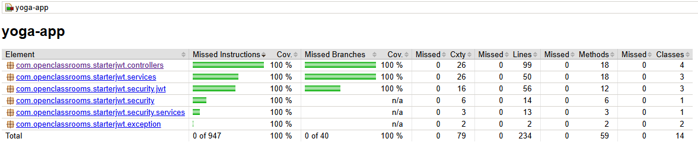
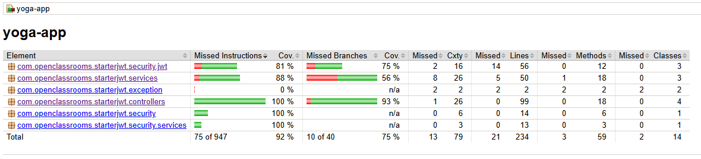

# 🧘 Yoga App

A complete web application — from backend to frontend — to manage yoga class reservations!

---

## 🛠️ Technologies utilisées

### Front-end
  
  


### Back-end
  
  
  


---

## 🚀 Getting Started

### 1. Clone the project

```bash
git clone https://github.com/MickC0/FS-P5-Savasana.git
```

---

### 2. Database (MySQL)

- Install and start mysql
- Open a terminal in `/YogaApp/ressources/sql`
- Connect to mysql with root user
- Execute :
```sql
SOURCE reset_db.sql;
CREATE USER 'TheUsername'@'%' IDENTIFIED BY 'ThePassword';
GRANT ALL ON yogadb.* TO 'TheUsername'@'%';
```
📌 The username and password must be the same as in the `application.properties`

---

### 3. Start backend

```bash
cd YogaApp/back
```

Set MySQL username and password dans :  
`src/main/resources/application.properties`

#### Start in development mode :
```bash
mvn spring-boot:run
```

#### Build and execute the jar :
```bash
mvn package
java -jar target/yoga-app-0.0.1-SNAPSHOT.jar
```

---

### 4. Start Front-end

```bash
cd YogaApp/front
npm install
npm run start
```

Access the application : [http://localhost:4200](http://localhost:4200)

🔐 Default Admin identifiers :
- **login** : `yoga@studio.com`
- **password** : `test!1234`

---

## ✅ Tests Front-end

📁 Folder : `/YogaApp/front`

### Unit and integration Tests (Jest)

```bash
npm run test
```

🧪 Report in : `/coverage/jest/lcov-report/index.html`

📸 

---

### Tests end-to-end (Cypress)

```bash
npm run e2e:ci
```

📄 Rapport : `/coverage/lcov-report/index.html`

📸 

---

## ✅ Tests Back-end

📁 Folder : `/YogaApp/back`

### Tests unitaires & d'intégration (JUnit)

```bash
mvn clean verify
```

📄 Unit tests report JaCoCo : `/target/site/jacoco-ut-coverage-report/index.html`

📸 


📄 Integration tests report JaCoCo : `/target/site/jacoco-it-coverage-report/index.html`

📸 

---

## 📦 Autres ressources

### Postman

For Postman import the collection

> ressources/postman/yoga.postman_collection.json

by following the documentation:

https://learning.postman.com/docs/getting-started/importing-and-exporting-data/#importing-data-into-postman

---

## 📎 Contributors

Me
